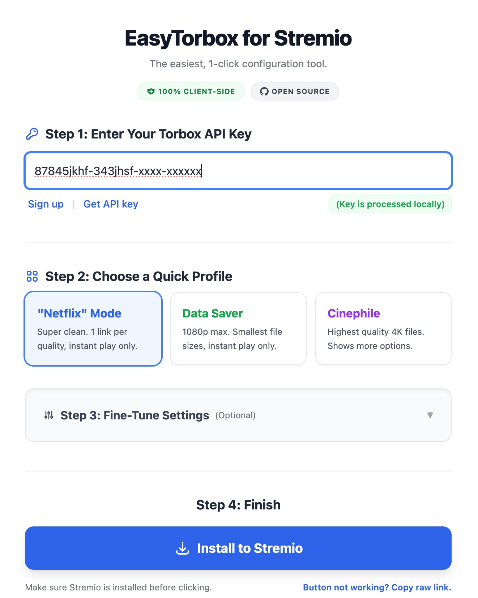
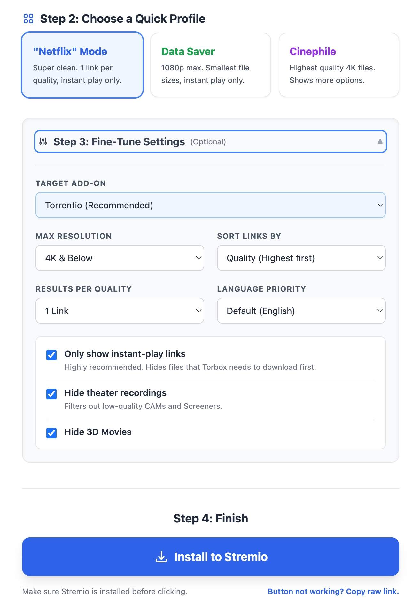
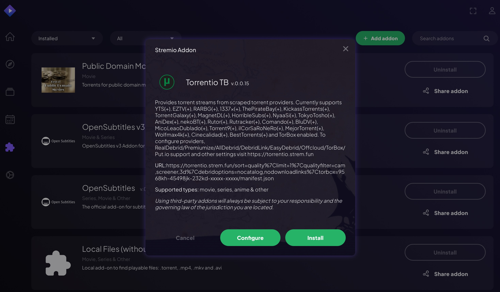
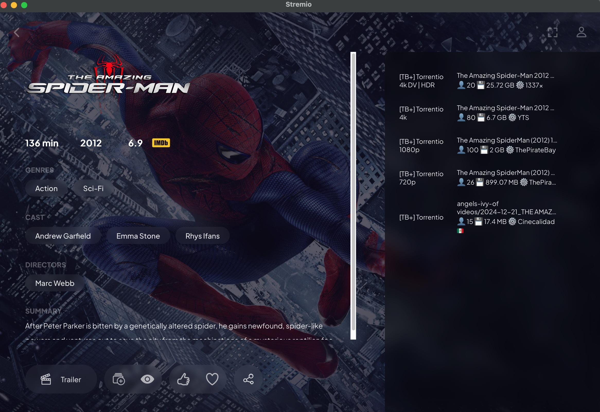
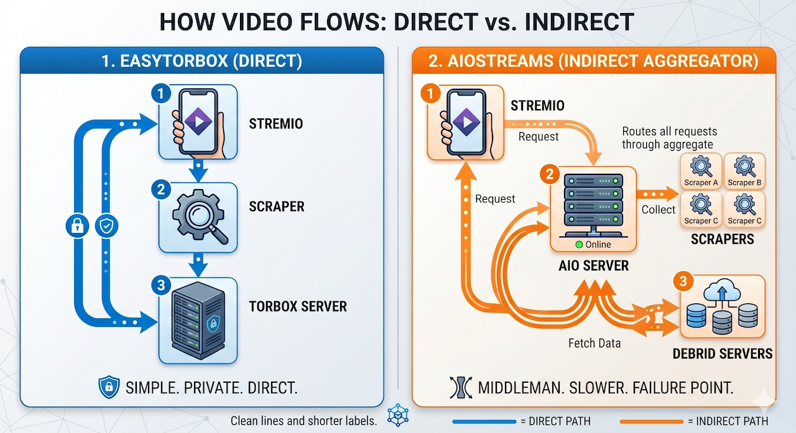

# 🚀 EasyTorbox for Stremio

A dead-simple, 1-click web tool designed to help you (or your non-tech-savvy friends and family) connect a [Torbox](https://torbox.app/) account to Stremio instantly. 

👉 **[Launch the Tool Here](https://easy-torbox.github.io/stremio/)**

## 🖼️ How it works

**1. Configure in seconds**  
Choose your profile and the tool handles the manifest encoding for you.  

**2. Enjoy a "Netflix" experience in Stremio**  
No more scrolling through 50 links. Get exactly what you need. 

## 💡 Why does this exist?
Configuring Stremio add-ons manually requires understanding video resolutions, cache settings and Debrid integrations. This tool strips all of that away into three simple "Quick Profiles" so anyone can get set up in seconds.

## 🔌 Supported Add-ons
This tool dynamically generates safe, properly-encoded Stremio installation links for the most popular Torbox-supported add-ons:
*   **Torrentio** *(Recommended - Highly stable)*
*   **Comet** *(v2.0.0 JSON schema supported)*
*   **StremThru Torz**
*   **Meteor**
*   **HdHub**

*(Note: MediaFusion is intentionally excluded from this tool because their recent v5 update requires server-side encryption. We strictly keep everything client-side!)*

## 🎬 The "Quick Profiles"
1.  🟦 **"Netflix" Mode:** The cleanest experience. Hides CAMs/3D, restricts results to exactly 1 instant-play link per resolution. No clutter.
2.  🟩 **Data Saver:** Caps resolution at 1080p and sorts by smallest file size first. Great for mobile viewing or strict data caps.
3.  🟪 **Cinephile:** Unrestricted quality. Shows all available 4K/HDR files sorted by highest quality first.

## 🔒 Strict Privacy Guarantee & Direct Connection
**Your API Key is completely safe.** This web app is 100% serverless and runs entirely inside your local browser via JavaScript. 

Unlike aggregator add-ons that route your stream requests through a middleman server, EasyTorbox configures Stremio to connect **directly** to the content providers. This means no server bottlenecks and total privacy.

Your Torbox API key, IP address, and configuration choices are **never** collected, logged, or transmitted to any external server. You can verify the entire codebase right here in the `index.html` file.

## 🧩 Community Referral Pool (Optional)
A separate page at [`referrals.html`](referrals.html) provides a simple community referral pool flow:
- Step 1: New users open a random community referral link
- Step 2: Users can submit their own referral

To reduce spam/random submissions, referral entries are validated in the Worker using:
- UUIDv4 format checks
- Torbox referral URL shape checks
- Upstream referral verification before acceptance

## ☕ Support EasyTorbox
If this tool saved you time, you can support ongoing maintenance:

  

---
*Disclaimer: This is an independent, open-source community project. It is not officially affiliated with Torbox, Stremio, or any of the add-on developers.*
