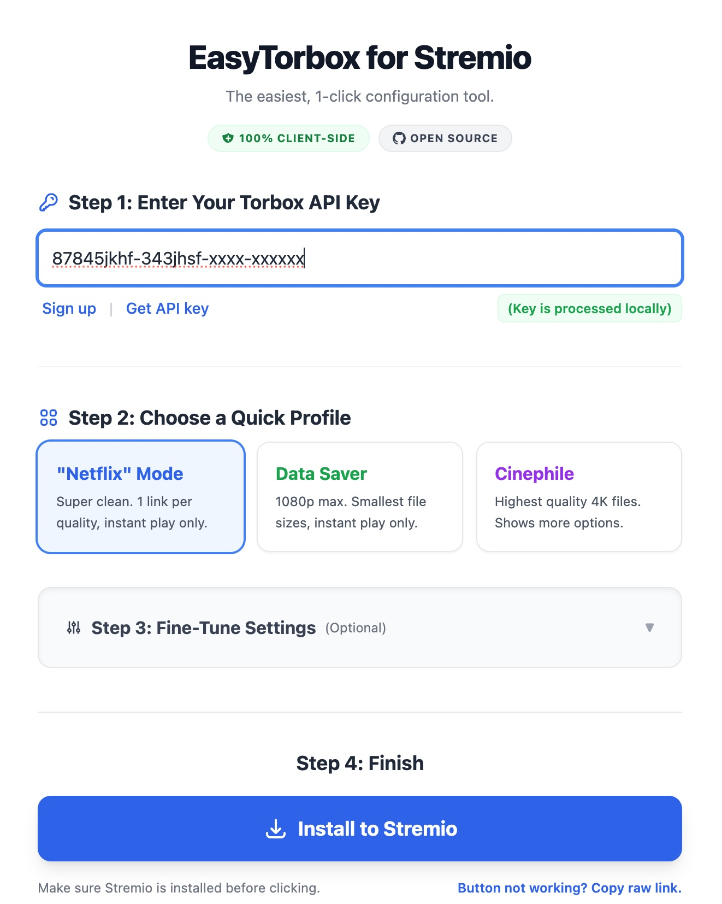
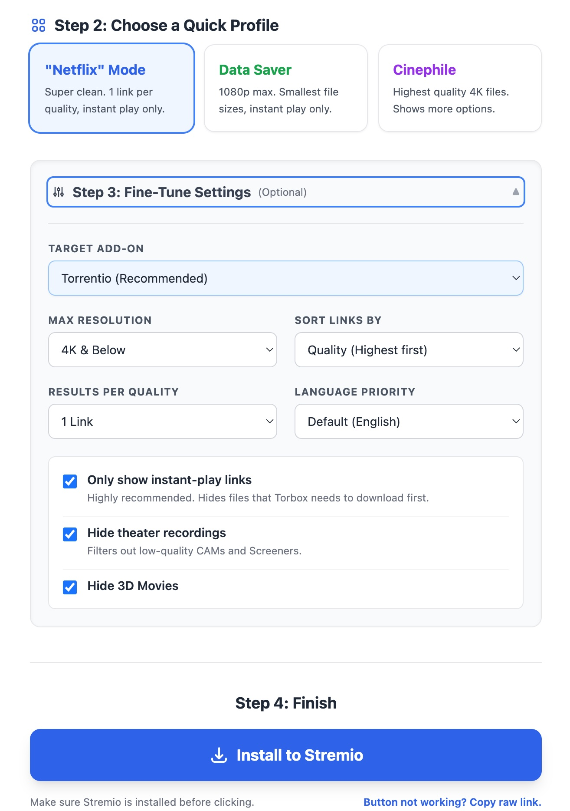
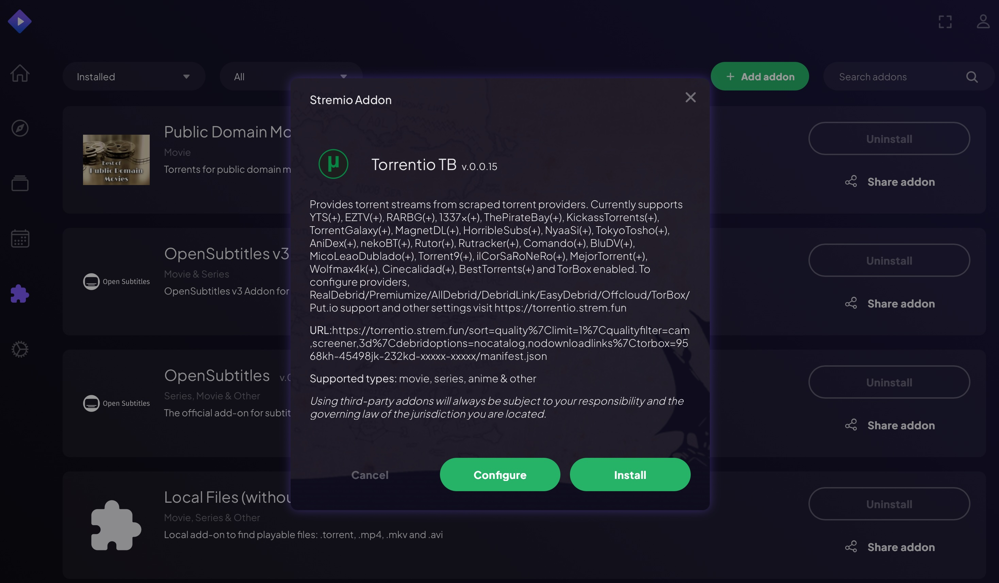
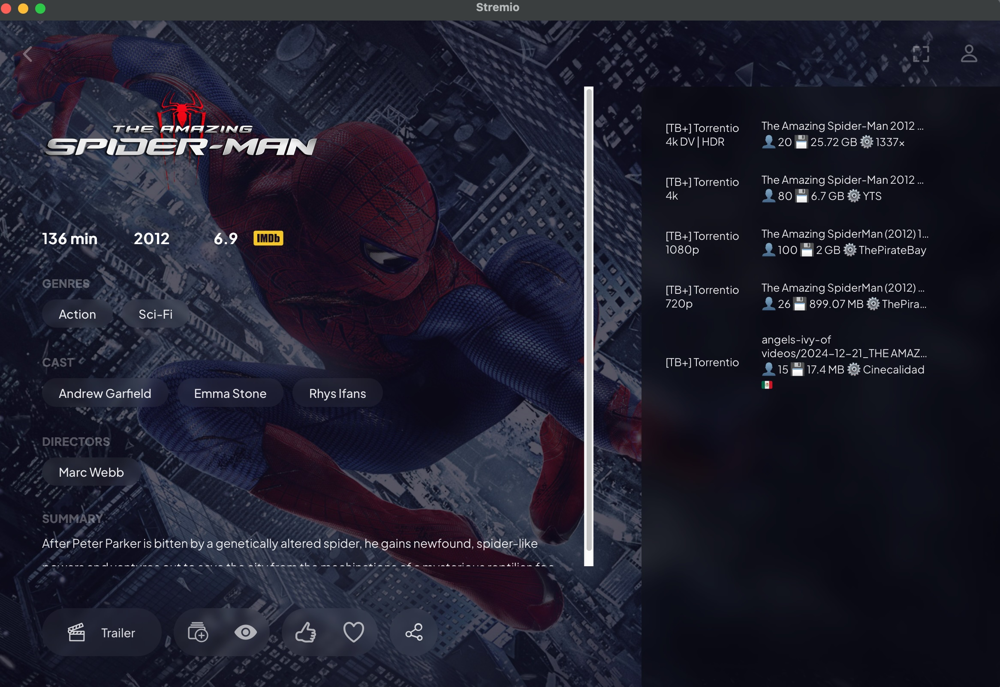
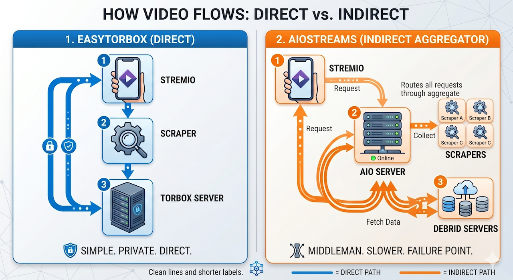

# 🚀 EasyTorbox for Stremio

A beginner-friendly web tool designed to help you (or your non-tech-savvy friends and family) connect an existing Torbox subscription to Stremio quickly, with optional community referral signup for new users.

👉 **[Launch the Tool Here](https://easy-torbox.github.io/stremio/)**

## ⚡ Beginner Start
1. Open [`index.html`](https://easy-torbox.github.io/stremio/index.html) via the launch link above.
2. Paste your Torbox API key from Torbox settings.
3. Keep the default settings or expand optional settings if you want to customize them.
4. Click **Install in Stremio**.

No Torbox subscription yet? Use the secondary **Sign up on Torbox** button below the setup area. EasyTorbox selects one community referral and sends you directly to Torbox to attempt a referral-attributed signup.

## 🖼️ How it works

**1. Configure in seconds**  
Choose your profile and the tool handles the manifest encoding for you.  

**2. Enjoy a "Netflix" experience in Stremio**  
No more scrolling through 50 links. Get exactly what you need. 

## 💡 Why does this exist?
Configuring Stremio add-ons manually requires understanding video resolutions, cache settings and Debrid integrations. This tool strips all of that away into three simple "Quick Profiles" so anyone can get set up in seconds.

## 🔌 Supported Add-ons
This tool dynamically generates safe, properly-encoded Stremio installation links for the most popular Torbox-supported add-ons:
*   **Torrentio** *(Recommended - Highly stable)*
*   **Comet** *(v2.0.0 JSON schema supported)*
*   **StremThru Torz**
*   **Meteor**
*   **HdHub**

*(Note: MediaFusion is intentionally excluded from this tool because their recent v5 update requires server-side encryption; EasyTorbox keeps API-key setup local.)*

## 🎬 The "Quick Profiles"
1.  🟦 **"Netflix" Mode:** The cleanest experience. Hides CAMs/3D, restricts results to exactly 1 instant-play link per resolution. No clutter.
2.  🟩 **Data Saver:** Caps resolution at 1080p and sorts by smallest file size first. Great for mobile viewing or strict data caps.
3.  🟪 **Cinephile:** Unrestricted quality. Shows all available 4K/HDR files sorted by highest quality first.

## 🔒 Local Setup Privacy & Direct Connection
**Your API key is not sent to EasyTorbox during setup.** The setup UI runs in your browser and prepares the Stremio install link locally.

Unlike aggregator add-ons that route your stream requests through a middleman server, EasyTorbox configures Stremio to connect **directly** to the content providers. This means no EasyTorbox server bottleneck for your Stremio setup.

Your Torbox API key and setup configuration choices are not collected by EasyTorbox during local setup. When you install, the selected add-on receives the key as part of its configuration, and any copied install link contains the key. Referral/signup and referral-submission flows use the EasyTorbox Worker for anti-abuse checks; that service may process request metadata such as IP-derived rate-limit hashes, Turnstile verification results, and referral request details.

## 🧩 Community Referral Pool
New-user signup now starts directly on [`index.html`](https://easy-torbox.github.io/stremio/index.html). A successful referral handoff means EasyTorbox selected one active community referral and started navigation to Torbox to attempt a referral-attributed signup. Torbox attribution is not externally verifiable by this project, and the handoff does not prove external registration, purchase, or bonus award.

The separate [`referrals.html`](https://easy-torbox.github.io/stremio/referrals.html) page is only for existing Torbox users who want to contribute their own referral code.

To reduce spam/random submissions, referral entries are validated in the Worker using:
- UUIDv4 format checks
- Torbox referral URL shape checks
- Upstream referral verification before acceptance

## ☕ Support EasyTorbox
If this tool saved you time, you can support ongoing maintenance:

  

### Crypto
- **🟢 ₮ USDT on TRON (TRC20)**
  `TKKAfAs5HNGqxtmHXbgxZfNYy65KWX1Gty`
  [🔳 QR](https://api.qrserver.com/v1/create-qr-code/?size=320x320&data=TKKAfAs5HNGqxtmHXbgxZfNYy65KWX1Gty)
- **🔵 $ USDC on Solana (SPL)**
  `Fa5oih6oyru6hwjaNSS8WEVc5ACEtpTGe7Zq197D7wW1`
  [🔳 QR](https://api.qrserver.com/v1/create-qr-code/?size=320x320&data=Fa5oih6oyru6hwjaNSS8WEVc5ACEtpTGe7Zq197D7wW1)

## ❓ FAQ
- **Why is Install disabled?**
  Add a valid Torbox API key first.
- **Stremio did not open after choosing Install in Stremio. What now?**
  Use the **Copy install link** button and paste it in Stremio.
- **Which referral page should I use?**
  New users should start on the main setup page. Existing Torbox users with an active eligible plan can use the referral page to submit their code.
- **Does a handoff mean a confirmed signup or verified attribution?**
  No. A handoff means EasyTorbox selected a referral and started navigation to Torbox. External registration completion and Torbox attribution are not visible to this site.

---
*Disclaimer: This is an independent, open-source community project. It is not officially affiliated with Torbox, Stremio, or any of the add-on developers.*
